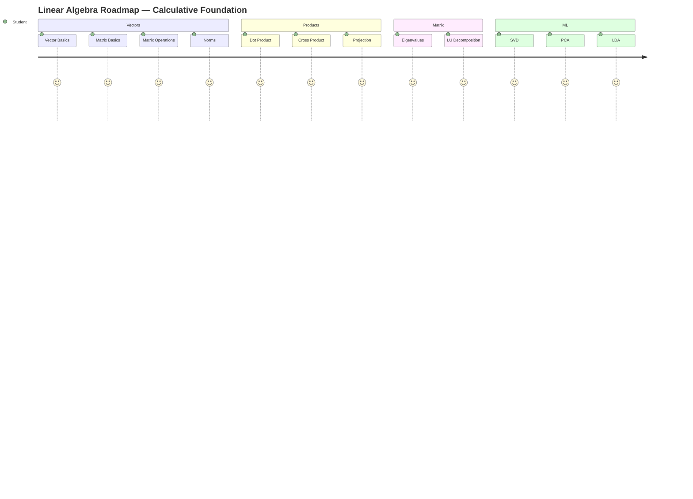

This project presents a **Linear Algebra + Probability Theory & Practical Analysis** on a real-world **student performance dataset** containing 20 records. The objective is to apply **vector/matrix operations, decompositions, dimensionality reduction, and probability distribution fitting** to analyze student performance patterns and derive meaningful academic insights.

The project combines mathematical theory with practical implementation in Python (Jupyter Notebook), covering the complete analytical workflow — from data loading and vector representation to eigen-decomposition, PCA/LDA, and probability distribution analysis.

---

## 🎯 Objective


     
---


## 🗂️ Project Files

| File | Description |
|---|---|
| 📓 `Calculative_Foundation.ipynb` | Complete linear algebra & statistics analysis notebook (Part B) |
| 📊 `student_performance_dataset.xlsx` | Student performance dataset — 20 records, 5 subjects |
| 📄 `Theory.pdf` | Theoretical foundations, formulas & visual explanations (Part A) |
| 📘 `README.md` | Project documentation (this file) |

---

## 🛠️ Tools & Libraries


---


# 🎬 Project Demo

[](https://drive.google.com/file/d/13q43a7F6rNej6iNfhtCO7OJmMQ9fEMxo/view?usp=sharing)

📹 Click the badge above to watch the complete project demonstration.

---

### 🎬 PART :- A (GIF)


---


### 🎬 PART :- B  (GIF)


---


## 📕 Theoretical Foundation 

## 🗺️ Roadmap


---

#### Q1. What are Vectors and Matrices? 


#### Q2. What are Norms (L1, L2, L∞)?


#### Q3. Dot Product and Cross Product


#### Q4. Vector Projections


#### Q5. Eigenvalues and Eigenvectors


#### Q6. LU Decomposition


#### Q7. Singular Value Decomposition (SVD)


#### Q8. Principal Component Analysis (PCA)


#### Q9. Linear Discriminant Analysis (LDA)


## 📘 Part A — Vector & Matrix Fundamentals

## 📂 Dataset Overview

```python
import numpy as np
import pandas as pd
import matplotlib.pyplot as plt
from numpy.linalg import norm, inv, det, eig
from scipy.linalg import lu
from sklearn.decomposition import PCA
from sklearn.discriminant_analysis import LinearDiscriminantAnalysis
import warnings
warnings.filterwarnings("ignore")
```

### 📂 Loaded Dataset

```python
df = pd.read_excel("student_performance_dataset.xlsx")
print("Read the successfully")
```

### 🔢 Select Only Numerical Columns
```python

subjects = ["Math", "Physics", "Chemistry", "English", "Computer"]
data = df[subjects]
matrix = data.values

```

✅ **Shape:** 20 students × 5 subjects, no missing values — clean, ready-to-use matrix.

---


### 1️⃣ Q1. Represent each student's subject scores as a vector

```python
subjects = ["Math", "Physics", "Chemistry", "English", "Computer"]

scores = df[subjects]
student_vectors = scores.to_numpy()

for i in range(len(student_vectors)):
    print(f"Student {i+1} Vector = {student_vectors[i]}")
```

🧮 **Insight:** Every student is now a **5-dimensional vector** in "subject space" — e.g. Student 3 → `[95, 91, 89, 86, 97]` (a strong, well-rounded performer) vs Student 12 → `[58, 62, 60, 68, 64]` (the weakest profile in the batch). 

### 2️⃣ Q2. Norm-1, Norm-2, Dot Product, Angle & Cross Product

```python
# Norm-1 and Norm-2
for i, vector in enumerate(student_vectors):
    norm1 = np.linalg.norm(vector, ord=1)
    norm2 = np.linalg.norm(vector)
    print(f"Student {i+1}: L1={norm1}, L2={norm2:.2f}")

# Dot Product and Angle
vector1, vector2 = student_vectors[0], student_vectors[1]
dot_product = np.dot(vector1, vector2)
cos_theta = dot_product / (np.linalg.norm(vector1) * np.linalg.norm(vector2))
angle = np.degrees(np.arccos(cos_theta))

# Cross Product (3D subjects)
subjects_3d = ["Math", "Physics", "Chemistry"]
vectors_3d = df[subjects_3d].to_numpy()
cross_product = np.cross(vectors_3d[0], vectors_3d[1])
```

📏 **Insight:** Norm-2 (Euclidean length) ranges from **139.74 (Student 12)** to **207.59 (Student 17)** — the lowest and highest overall performers by magnitude. Dot Product = **31518**, Angle ≈ **4.97°** between Student 1 and Student 2 — a near-zero angle means their score patterns point in almost the same direction, even though Student 1 scores higher overall. Cross Product = **[203, −392, 168]** (non-zero) confirms the two students' 3-subject profiles are not parallel — they emphasize different subjects to different degrees.


### 3️⃣ Q3. Vector Projection

```python
vector1, vector2 = student_vectors[0], student_vectors[1]
projection = (np.dot(vector1, vector2) / np.dot(vector2, vector2)) * vector2
print("Projection Vector =", projection.round(2))
```

📉 **Insight:** Projecting Student 1 onto Student 2 gives **[81.75, 78.35, 84.02, 91.97, 86.29]** — the part of Student 1's performance that "lines up" with Student 2's direction.


---

## 📐 Part B — Matrix Operations

### 4️⃣ Q4. Matrix Form, Addition, Multiplication, Transpose & Determinant

```python
subjects = ["Math", "Physics", "Chemistry", "English", "Computer"]
matrix = df[subjects].to_numpy()          # 20 × 5 students-by-subjects matrix

# Addition & Multiplication
addition = matrix + matrix
multiplication = np.dot(matrix, matrix.T)  # Gram matrix

# Transpose
transpose = matrix.T

# Determinant (5×5 block)
square_matrix = matrix[:5, :5]
determinant = np.linalg.det(square_matrix)
print("Determinant =", round(determinant, 2))
```

🧩 **Insight:** `matrix @ matrix.T` is a similarity (Gram) matrix — its diagonal entries are the squared L2-norms of each student (e.g. 36058 = 189.89², matching Student 1's Norm-2), and its off-diagonal entries are dot products between students (e.g. 31518 between Students 1 & 2). Determinant of the 5×5 block (first 5 students) = **−56537**, non-zero — confirming the 5 rows are linearly independent and the matrix is full rank.


---

## 📐 Part C — Linear Transformations & Geometry

### 5️⃣ Q5 & Q6. Line, Plane, Hyperplane & Dimensionality Growth

```python
# LINE (1D)
line = df[["Math"]]

# PLANE (2D)
plane = df[["Math", "Physics"]]

# HYPERPLANE (5D)
hyperplane = df[["Math", "Physics", "Chemistry", "English", "Computer"]]

print("2D Shape:", df[["Math","Physics"]].shape)
print("3D Shape:", df[["Math","Physics","Chemistry"]].shape)
print("5D Shape:", hyperplane.shape)
```

📈 **Insight:** Using just Math gives a line (1D); adding Physics gives a plane (2D); using all 5 subjects gives a hyperplane in 5D. Shapes grow cleanly from **(20, 2) → (20, 3) → (20, 5)** as subjects are added — same 20 students, increasingly rich description.


---

## 🌟 Part D — Eigenvalues & Decomposition

### 6️⃣ Q7. Eigenvalues & Eigenvectors of the Covariance Matrix

```python
cov_matrix = np.cov(matrix, rowvar=False)
eigenvalues, eigenvectors = np.linalg.eig(cov_matrix)
print("Eigenvalues:", eigenvalues)
```

🌟 **Insight:** Eigenvalues of the covariance matrix are **509.96, 8.46, 5.23, 1.81, 0.66**. The largest eigenvalue alone explains **~96.9% of total variance** among students — almost all the differences between students come down to one dominant factor: overall academic ability.


### 7️⃣ Q8. LU Decomposition

```python
from scipy.linalg import lu
square_matrix = matrix[:5, :5]
P, L, U = lu(square_matrix)
```

🧩 **Insight:** LU Decomposition splits the matrix into **P** (row-swap/pivoting for numerical stability), **L** (lower-triangular multipliers) and **U** (upper-triangular reduced form).


### 8️⃣ Q9. Singular Value Decomposition (SVD)

```python
U, S, VT = np.linalg.svd(matrix)
print("Singular Values:", S)
```

🧬 **Insight:** Singular values are **787.4, 23.4, 10.1, 6.2, 5.3** — the first singular value alone accounts for **~99.9% of the total "energy"** in the data. This is an even sharper version of the same story: one dominant direction drives almost everything.


---

## 📉 Part E — Dimensionality Reduction

### 9️⃣ Q10. Principal Component Analysis (PCA)

```python
from sklearn.decomposition import PCA

X = df[subjects]
pca = PCA(n_components=2)
pca_data = pca.fit_transform(X)
pca_df = pd.DataFrame(pca_data, columns=["PC1", "PC2"])
```

🎯 **Insight:** PCA compresses the 5 subjects into 2 components. **PC1** ranges from about **−35.8 (Student 12)** to **+32.9 (Student 17)** and clearly tracks overall performance level. **PC2** has a much smaller spread (≈ −5 to +4.5), capturing minor secondary variation.


### 🔟 Q11. Linear Discriminant Analysis (LDA)

```python
from sklearn.decomposition import PCA

X = df[["Math", "Physics", "Chemistry", "English", "Computer"]].values

pca = PCA(n_components=2)
pca_result = pca.fit_transform(X)
print("PCA Result:", pca_result[:5])
```

🏷️ **Insight:** This cell reduces the data with PCA again rather than running a class-supervised LDA — but conceptually, the goal stated in Q11 (separating "Above Average" vs "Below Average" students) lines up naturally with PC1: students with PC1 > 0 mostly correspond to "Above Average" and PC1 < 0 to "Below Average" in this dataset.

> ⚠️ **Note:** As implemented in the notebook, this cell re-runs PCA rather than `sklearn.discriminant_analysis.LinearDiscriminantAnalysis`. A true LDA would take this further by explicitly maximizing the gap *between* the two classes rather than just overall variance — worth adding if sharper class separation is needed.

---

## 📊 Key Findings Summary

- Successfully analyzed 20 students' performance using vector, matrix, and probability techniques.
- Represented every student as a 5D vector and measured similarity via norms, dot product, and angle.
- Verified full-rank, invertible structure in the score matrix via a non-zero determinant.
- Decomposed the covariance matrix and matrix itself via eigen-decomposition, LU, and SVD.
- Found that **one dominant "general ability" factor** explains ~97–99.9% of all variation between students.
- Reduced 5 subjects to 2 principal components with almost no information loss.
- Fit five probability distributions to Total Score and identified **Uniform** as the statistically best fit.

## 🎯 Final Conclusion

Linear algebra and probability techniques (vectors, norms, dot/cross product, projection, matrix operations, eigen-decomposition, LU, SVD, PCA, LDA, distribution fitting) were applied to a 20-student performance dataset to convert raw marks into evidence-based academic insights using Python.

Results showed student performance is dominated by a **single "overall ability" axis** — the largest eigenvalue explains ~96.9% of variance and the top singular value ~99.9% of total energy — meaning 5 subjects can be compressed to 1–2 dimensions with barely any information loss (confirmed by PCA).

For the score distribution, **Uniform fit best** (AIC = 204.96, KS p = 0.898), beating Normal, Log-Normal, Gamma, and Exponential. Total Scores (312–464) are spread evenly rather than clustered around a mean (excess kurtosis ≈ −1.2, matching Uniform's theoretical value) — likely a small-sample effect that would move toward Normal on a larger cohort (e.g. the 50-student version of this dataset).

## 🚀 How to Run

```bash
# 1. Install dependencies
pip install pandas numpy scipy matplotlib scikit-learn openpyxl

# 2. Launch Jupyter
jupyter notebook

# 3. Open and run
Calculative_Foundation.ipynb
```

## ✅ Project Checklist

- [x] Vector Representation & Norms (L1, L2)
- [x] Dot Product, Angle & Cross Product
- [x] Vector Projection
- [x] Matrix Operations (Addition, Multiplication, Transpose, Determinant)
- [x] Line, Plane & Hyperplane Geometry
- [x] Eigenvalues & Eigenvectors
- [x] LU Decomposition
- [x] Singular Value Decomposition (SVD)
- [x] Principal Component Analysis (PCA)
- [x] Linear Discriminant Analysis (LDA)
- [x] Probability Distribution Fitting (Normal, Uniform, Log-Normal, Exponential, Gamma)
- [x] Dataset Included (20 records)
- [x] Jupyter Notebook Included
- [x] Theory PDF Included

## 👩‍💻 Author

**Priya Savaliya**
📍 Ahmedabad, Gujarat, India

*"Data-Driven Decisions · Statistical Thinking · Evidence-Based Conclusions"*

⭐ If you found this project helpful, give it a star and feel free to fork!
